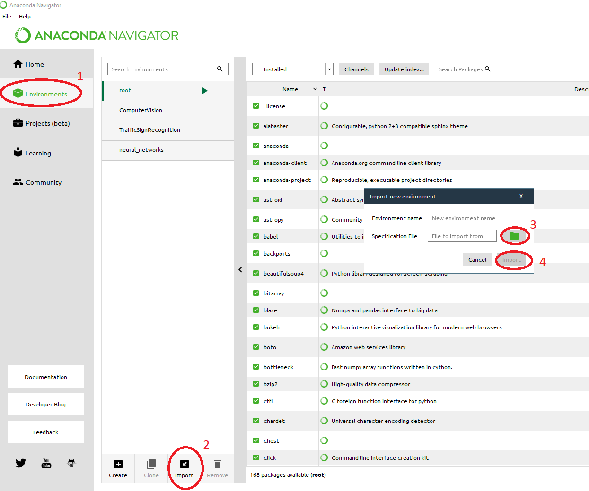
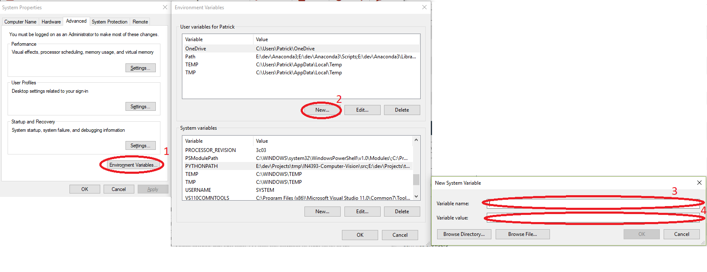
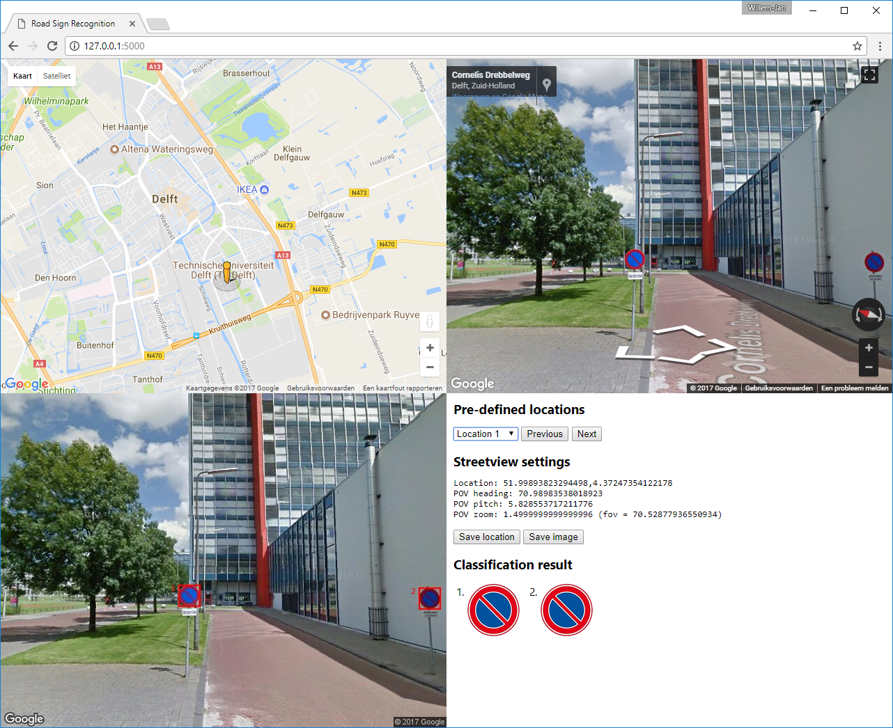

# IN4393 Computer Vision - Final Project
## Road Sign Detection on Google Streetview

### Set up environment
In order to run our code, please check out our repository with git.
After downloading your copy of our code, please unzip the ```training_data.zip``` file that is located in the folder ```data```.

Before the code can be run, the python environment has to be prepared.
To do this, please install [Anaconda](https://www.continuum.io/downloads)

Now that Anaconda is installed, please start ```Anaconda Navigator```.  


1. click on ```Environments``` 
2. click ```Import```.
3. Browse your harddisk to the path where you placed our code and select the ```environment.yml``` file in the ```env``` directory.
4. Press ```Ok``` and press ```Import```. The python environment will now be prepared.

In the mean time, please add our project directories to your ```PYTHONPATH```.  
On windows this can be done by pressing ```windows_key + r```  
type: ```SystemPropertiesAdvanced``` and press ```Enter```, then go to the tab ```Advanced``` .



1. press the button ```Environment Variables```.  
2. Press ```New...``` at user variables.
3. Variable name: ```PYTHONPATH```  
4. Variable value: ```path_to_our_code\src;path_to_our_code\src\data_preparation;path_to_our_code\src\detection;path_to_our_code\src\features;path_to_our_code\src\test;path_to_our_code\src\webapp```  
Where ```path_to_our_code``` should be replaced with the path to our code.

Once the python environment is installed by Anaconda, an environment named ```road_sign_detection``` should be visible.

### Run our webapplication
Please open a Command Prompt and navigate to ```path_to_our_code\src\webapp``` and type ```activate road_sign_detection```.  
Now run ```python server.py```. The following message should appear:  
```
 * Restarting with stat
 * Debugger is active!
 * Debugger PIN: 
 * Running on http://127.0.0.1:5000/ (Press CTRL+C to quit
```
The webserver is runnning and the webapp can be used by visiting ```http://127.0.0.1:5000``` in your browser.  
The result should look like this:

